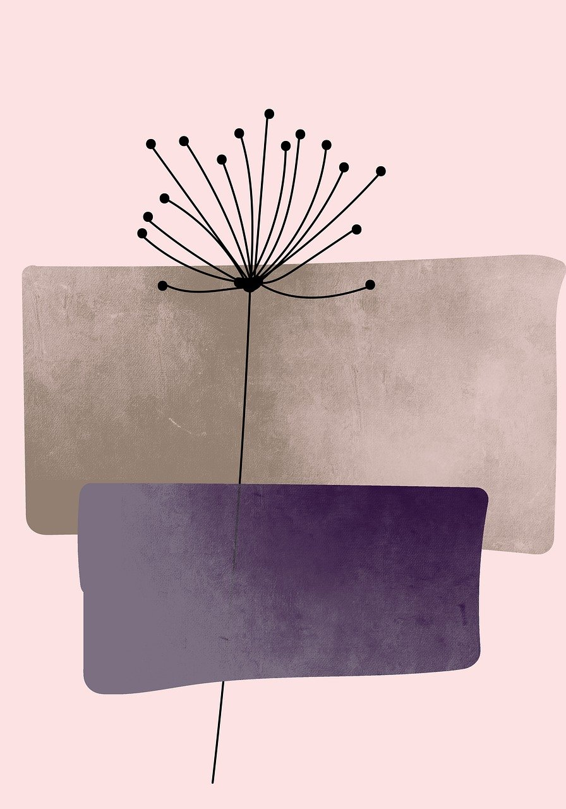
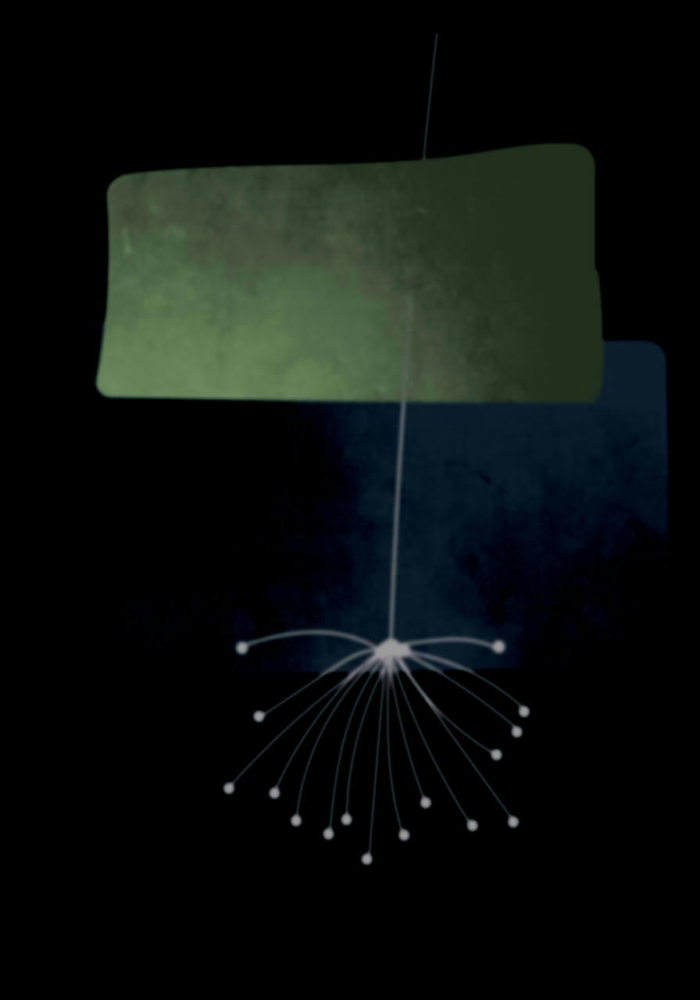

# rust image editor
Rust program for image manipulation.

Works with most image types, as long as INPUT and OUTPUT have the same file extension.

## usage
`cargo run <INPUT> <OUTPUT> [OPTIONS]`

### features
`--blur VALUE`: gaussian blur 

`--rotate VALUE`: rotate image (90, 180 or 270 deg)

`--brighten VALUE`: brighten image

`--crop "x,y,w,h"`: crop image

`--invert`: invert colors

`--grayscale`: convert to grayscale

`--solid "r,g,b"`: turn image into solid color

`--fractal`: fractalize image

### example

`cargo run image.jpg out.jpg --blur 2.5 --invert --rotate 180 --brighten 100`

<table>
  <tr>
    <th>original</th>
    <th>output</th>
  </tr>
  <tr>
      <th></th>
      <th></th>
  </tr>
</table>

## about
Final project for Udemy's [Ultimate Rust Crash Course](https://www.udemy.com/course/ultimate-rust-crash-course) by Nathan Stocks.

Base source code [here](https://github.com/CleanCut/ultimate_rust_crash_course/blob/main/exercise/z_final_project/src/main.rs).